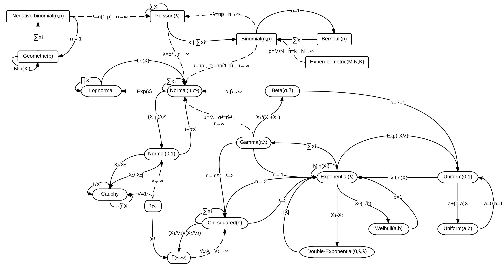

```{r setup, include=FALSE}
knitr::opts_chunk$set(echo = TRUE, out.width = "100%")
options(width = 60, digits = 4)
set.seed(20261001)
library(tidyverse)
```

# Transformations

## A new variable

Suppose we have some random variable $X$ with a very complex $Q(u)$ so that the inversion method is difficult to implement.

For example, the Normal distribution's $F(x)$ cannot be written in closed form, so we can't easily invert it.

Then we must search for **transformations** of random variables that we can sample from.

General strategy: **show $F(x) = G(x)$**, where $G$ is the CDF of the transformation.

##

{width=95%}

\tiny Source: Wikipedia, "Relationships among probability distributions."

## Creating variables from functions of other variables

Sometimes we define **RVs as functions of other random variables**.

Examples:

- The "log Normal" distribution:
      $$X = \exp(Y), \quad Y \sim N(\mu, \sigma^2)$$
- The $\chi_k^2$ distribution: $\sum_{i=1}^k Z_i^2, Z_i \iid N(0, 1)$
- The $t_k$ distribution: $Z / \sqrt{V / k}$, with $Z \sim N(0, 1)$ independent of $V \sim \chi^2_k$
- Test statistics/estimators: $f(X_1, X_2, \ldots, X_n)$

## More difficult case: Working backwards

Suppose we want to sample $X$, can we find transformations that lead to it?

Tips and tricks:

- Reduce to a simpler case
- Write down $f(x)$ or $F(x)$ and find patterns.
- Try conditioning on some event, then randomly generate that event.
- Calculus techniques on $f(x)$ (change of variables)

## Laplace Distribution

Here is the PDF of the **Laplace distribution**:
$$f(x) = \frac{1}{2} \exp\left\{ - |x - \theta| \right\}$$
For example, when $\theta = 2$

```{r echo=FALSE, fig.height=1.8, fig.width=6}
par(mar = c(2, 0, 0, 0))
curve(1/2 * exp( -1 * abs(x - 2)), from = -1, to = 5)
```

## Example: Laplace distribution

To generate:
$$ X \sim \text{Laplace}(\theta)$$
Claim: $X$ can be generated by a transformation:
$$X = SM + \theta$$
where:
$$P(S = 1) = 0.5, P(S = -1) = 0.5,  \quad M \sim \text{Exp}(1)$$

Where does this come from?

## Reducing to a simpler case

First, let's deal with the **parameter $\theta$**.

Let $Y \sim \text{Laplace}(\theta)$ with CDF:
$$P(Y \le t) = \int_{-\infty}^t \frac{1}{2} e^{-|y - \theta|} \, dy$$

Perform a **change of variables**, $x = y - \theta$ so $y = x + \theta$ and $dy = dx$, so that
$$P(Y \le t) = \int_{-\infty}^{t - \theta} \frac{1}{2} e^{-|x|} \, dx  = P(X \le t - \theta)  = P(X + \theta \le t)$$
where $X \sim \text{Laplace}(0)$. In other words, $Y$ is a **Laplace(0) added to $\theta$**.

## Using symmetry of $X$

Notice that $X$ (with $\theta = 0$) is **symmetric about 0**:
$$f(x) = \frac{1}{2} \exp\{ -|x| \} = f(-x)  \Rightarrow P(X < 0) = P(X > 0) = \frac{1}{2}$$

We can use the **disjoint events** $X < 0$ and $X > 0$ to write:
$$P(X \le t) = P(X \le t \mid X < 0) P(X < 0) + P(X \le t \mid X > 0) P(X > 0)$$

## Conditioning

By the definition of conditional probability:
$$P(X \le t \mid X > 0) = \frac{P(X \le t, X > 0)}{P(X > 0)} = \frac{P(0 < X \le t)}{P(X > 0)}$$
Notice that (for $t > 0$):
$$P(X \le t \mid X > 0) = \frac{\int_{0}^t f(x) \, dx}{P(X > 0)}   = \int_{0}^t \frac{(1/2) \exp \{ -|x| \}}{1/2} \, dx  = \int_{0}^t \exp\{ -x \} \, dx$$

## Recognizing CDF

We saw that $X \mid X > 0$ had the CDF:
$$P(X \le t \mid X > 0) = \int_{0}^t \exp\{ -|x| \} \, dx  = \int_{0}^t \exp\{ -x \} \, dx$$

We recognize that $X \mid X > 0 = M \sim \text{Exp}(1)$ and by symmetry we see that $X \mid X < 0$ is $-M$.

Let $A$ be the event that $X > 0$, which has $P(A) = 1/2$.

- When $A$ occurs $X = M$.
- When $A^c$ occurs, $X = -M$
- In other words, if $P(S = 1) = P(S = - 1) = 1/2$, then $X = S M$

## Putting it all together

We first saw that if
$$Y \sim \text{Laplace}(\theta)  \Rightarrow Y = X + \theta, X \sim \text{Laplace}(0)$$

How to generate Laplace(0)? We found that could be represented as:
$$X = S M, M \sim \text{Exp}(1), P(S = 1) = P(S = -1) = 1/2$$

In R:

```{r}
rlaplace <- function(n, theta) {
    sample(c(-1, 1), n, replace = TRUE) * rexp(n) + theta }
```

## Checking results

```{r echo=FALSE, fig.height=3, fig.width=6}
ggplot(data.frame(y = rlaplace(10000, theta = 2)), aes(x = y)) +
  geom_density(fill = "blue", alpha = 0.5) +
  stat_function(fun = function(x) { 1/2 * exp(-1 * abs(x - 2))},
                linewidth = 2, color = "red")
```


## Transformations Summary

We want to sample from $X$, but can't (or don't want to) use the quantile method. If we know $f(x)$ or $F(x)$, we can sometimes work backwards using these techniques:

- Reduce to a simpler case
- Write down $f(x)$ or $F(x)$ and find patterns.
- Try conditioning on some event, then randomly generate that event.
- Calculus techniques on $f(x)$ (change of variables)

No single algorithm will always work, so this method requires a lot of creativity.

# Sums and Convolutions

## Linear combinations of variables

Two ways of combining variables linearly are particularly common:

- Linear combination of random variables (convolutions): $X = \sum a_i Y_i$
- Linear combination of distribution functions (mixtures): $F_X(t) = \sum a_i F_i(t)$ where $0 \le a_i \le 1$ and $\sum a_i = 1$.

They are **not equivalent**. With independent $Y_1 \sim N(-2, 1)$ and $Y_2 \sim N(2, 1)$, the average $(Y_1 + Y_2)/2 \sim N(0, 1/2)$ has one mode, while the 50/50 mixture of the two has two.

We cover sums first, then mixtures.

## Convolutions

For independent $X$ and $Y$ with densities, $Z = X + Y$ has the density
$$f_Z(z) = \int_{-\infty}^\infty f_X(z - y) f_Y(y) \, dy,$$
which is called the **convolution** of $f_X$ and $f_Y$.

The integral is often hard to compute, but **sampling $Z$ is easy**: draw $X$ and $Y$ and add them.

If a target distribution can be written as a sum of variables we can already draw, we have a sampler for it.

## Gamma as a sum of exponentials

If $E_1, \ldots, E_k \iid \text{Exp}(\lambda)$, then
$$\sum_{i=1}^k E_i \sim \text{Gamma}(k, \lambda).$$

With the exponential sampler from video 1, $E_i = -\log(U_i) / \lambda$:

```{r}
rgamma_sum <- function(n, k, rate) {
  e <- matrix(-log(runif(n * k)) / rate, nrow = k) # one column per draw
  colSums(e)
}
```

This works only for **integer** shape $k$.

## Checking the Gamma sampler

```{r echo=FALSE, fig.height=3, fig.width=6}
ggplot(data.frame(x = rgamma_sum(10000, k = 3, rate = 2)), aes(sample = x)) +
  geom_qq(distribution = qgamma, dparams = list(shape = 3, rate = 2)) +
  geom_abline(intercept = 0, slope = 1) +
  labs(x = "Gamma(3, 2) quantiles", y = "Sample quantiles")
```

## Binomial as a sum of Bernoullis

If $B_1, \ldots, B_m \iid \text{Bernoulli}(p)$, then $\sum_{i=1}^m B_i \sim \text{Bin}(m, p)$. A Bernoulli draw is $U \le p$.

```{r}
rbinom_sum <- function(n, size, prob) {
  b <- matrix(runif(n * size) <= prob, nrow = size)
  colSums(b)
}
x <- rbinom_sum(10000, size = 5, prob = 0.3)
round(rbind(sampled = table(factor(x, levels = 0:5)) / 10000,
            exact = dbinom(0:5, 5, 0.3)), 3)
```

Each draw costs `size` uniforms, so for large `size` inversion is cheaper.

# Mixture Distributions

## Defining a mixture

A **mixture** of distributions $F_1, \ldots, F_k$ has the CDF
$$F(x) = \sum_{i=1}^k a_i F_i(x), \qquad 0 \le a_i \le 1, \quad \sum_{i=1}^k a_i = 1.$$
The $F_i$ are the **components** and the $a_i$ are the **mixing weights**.

The same distribution can be perceived in two ways:

- **Latent variable**: an unobserved $C$ with $P(C = i) = a_i$ picks the component. Draw $C$, then draw $X$ from $F_C$.
- **Random parameter**: the components are one family $F(x ; \theta)$, and $\theta$ is itself random. Draw $\theta$, then draw $X$ from $F(x ; \theta)$.

## Basic properties of mixtures

Proof that $F(t) = \sum_{i = 1}^k a_i F_i(t), 0 \le a_i \le 1, \sum_{i=1}^k a_i = 1$ is a valid distribution

- Bounded above by 1 (and likewise below by 0):
      $$\lim_{t \rightarrow \infty} F(t) = \lim_{t \rightarrow \infty} \sum_{i=1}^k a_i F_i(t) = \sum_{i = 1}^k a_i \lim_{t \rightarrow \infty} F_i(t) = \sum_{i=1}^k a_i = 1$$
- Nondecreasing: for $t_2 > t_1$,
      $$a_i F_i(t_1) \le a_i F_i(t_2) \Rightarrow \sum_{i=1}^k a_i F_i(t_1) \le \sum_{i=1}^k a_i F_i(t_2) \Rightarrow F(t_1) \le F(t_2)$$
- If all $F_i$ have density $f_i$,
$$\frac{d}{d x} F(x) = \sum_{i=1}^k a_i \frac{d}{d x} F_i(x) = \sum_{i=1}^k a_i f_i(x) = f(x)$$


## Example: Bimodal Normal

$$f(x) = 0.25 \phi(x + 2) + 0.75 \phi(x - 1)$$

```{r echo=FALSE, fig.height=2.3, fig.width=6}
ggplot() + xlim(-5, 4) +
  stat_function(fun = function(x) 0.25 * dnorm(x + 2) + 0.75 * dnorm(x - 1)) +
  stat_function(fun = function(x) 0.25 * dnorm(x + 2), linetype = 2, color = "blue") +
  stat_function(fun = function(x) 0.75 * dnorm(x - 1), linetype = 2, color = "red") +
  labs(x = "x", y = "density")
```

The dashed curves are the weighted components $0.25 \phi(x + 2)$ and $0.75 \phi(x - 1)$.

## Mixtures: "latent variables"

A **latent variable** is a random variable that **is not observed.** If $P(C = i) = a_i$ and $X \mid C = i \sim F_i$, then
$$P(X \le t) = \sum_{i=1}^k P(X \le t \mid C = i) P(C = i) = \sum_{i=1}^k a_i F_i(t).$$

For the bimodal Normal, $C$ picks the mode:

```{r}
k <- 10000
C <- rbinom(k, size = 1, prob = 0.75)
mix_latent <- ifelse(C == 1, rnorm(k, mean = 1), rnorm(k, mean = -2))
```

The Laplace distribution is also a latent-variable mixture, of Exp(1) and $-\text{Exp}(1)$.

## Mixtures: "random parameters"

When the components are one family $F(x ; \theta)$, we draw $\theta$ first and then $X \mid \theta \sim F(x ; \theta)$.

The bimodal Normal is $N(\mu, 1)$ where $\mu$ is $1$ with probability $0.75$ and $-2$ otherwise:

```{r}
mu <- sample(c(1, -2), k, replace = TRUE, prob = c(0.75, 0.25))
mix_param <- rnorm(k, mean = mu)
```

The parameter can also vary **smoothly**, $\theta \sim G$, which gives
$$F(x) = \int F(x ; \theta) \, g(\theta) \, d\theta.$$
For example, $\theta \sim U(0, 1)$ and $X \mid \theta \sim \text{Bin}(10, \theta)$.

## Example: Noisy Data

Suppose you are sampling data that you believe is (iid)
$$ Y_i \sim N(\mu, 1)$$

Your goal is to test a hypothesis about $\mu$, for example:
$$H_0: \mu = 0 \quad \text{vs} \quad H_1: \mu \ne 0$$

Suppose about 1 in 5 of our data gets contaminated by adding
$$Y_i + \epsilon_i, \quad \text{where } \epsilon_i \sim  N(0, 9) (\text{iid})$$
Our observed data is either $N(\mu, 1)$ (with probability 0.8) or $N(\mu, 10)$ (with probability 0.2).

## Contaminated data is a mixture

With a latent $B_i \sim \text{Bernoulli}(0.2)$ marking the contaminated observations,
$$X_i = Y_i + B_i \epsilon_i, \qquad F_X(x) = 0.8 F(x ; \mu, 1) + 0.2 F(x ; \mu, 10).$$

```{r}
rnoisy <- function(n, mu) {
    y <- rnorm(n, mean = mu, sd = 1)
    epsilon <- rnorm(n, mean = 0, sd = 3)
    b <- rbinom(n, size = 1, prob = 0.2)
    y + b * epsilon
}
```

## Mixture compared to the components (log scale)

```{r echo=FALSE, fig.height=3, fig.width=6}
noisy_density <- function(x) { 0.8 * dnorm(x) + 0.2 * dnorm(x, sd = sqrt(10))}
par(mar = c(2, 2, 1, 0))
curve(log10(noisy_density(x)),
      ylab = "Log_10 Density", xlab = "x", main = NA,
      from = -10, to = 10, ylim = c(-4, 1))
curve(log10(dnorm(x, mean = 0, sd = 1)), add = TRUE, col = "red", lty = 2)
curve(log10(dnorm(x, mean = 0, sd = sqrt(10))), add = TRUE, col = "blue", lty = 2)
legend("topleft", col = c("red", "blue", "black"), lty = c(2, 2, 1),
       legend = c("Signal", "Noise", "Mixture"))
```

## Testing without contamination

We want to test the following hypothesis at the $\alpha = 0.05$ level:
$$H_0: \mu = 0 \quad \text{vs} \quad H_1: \mu \ne 0$$

Suppose **we didn't know about the contamination** so that we thought:
$$X_i \sim N(0,1) \quad \text{when $H_0$ is true}$$

If we use the **sample mean** as the **test statistic**, we would think that the following **rejection rule** would have proper $\alpha$-level:
\begin{center}
    Reject if $\left| \bar X \right| \ge `r round(qnorm(0.975), 3)` / \sqrt{n}$ and accept otherwise.
\end{center}

## Does our rejection rule have proper size?

Observe that even with contamination, the null hypothesis $H_0: \mu = 0$ would hold if $X_i \sim (0.8) N(0, 1) + (0.2) N(0, 10)$. Do we reject this null hypothesis too often? Not enough?

Procedure for testing the Type I error rate:

- Pick $\alpha$-level ($\alpha = 0.05$)
- Find a rejection region ($|\bar X| \ge 1.96 / \sqrt{n}$)
- Sample from the null hypothesis. (e.g., 1000 groups of 10 each)
- Compute the test statistic distribution.
- How often is the hypothesis rejected?

##

Group the data generated under the null that $H_0: \mu = 0$ into 1000 groups of 10:

```{r}
noisy_groups <- replicate(1000, rnoisy(10, 0), simplify = FALSE)
```

Compute the test statistic distribution:

```{r}
noisy_means <- map_dbl(noisy_groups, mean) # distribution of T
```

Compute the proportion of test statistics that lead to rejecting the true null hypothesis:

```{r}
(noisy_size <- mean(abs(noisy_means) >= qnorm(0.975, sd = 1/sqrt(10))))
```

**We reject the true null about $`r round(noisy_size / 0.05)`\times$ too often!**

## Achieving proper size

In a sense, this wasn't really a fair fight. We **ignored the contamination**.

Let's find an actual $\alpha$-level rejection region (instead of using the one from $N(0,1)$).

```{r}
(noisy_mean_cutoffs <- quantile(noisy_means, c(0.025, 0.975)))
```

Let's validate that this has proper size:

```{r}
mean(noisy_means <= noisy_mean_cutoffs[1] |
     noisy_means >= noisy_mean_cutoffs[2])
```

## Trimmed Means

We know that about 20\% of our data are contaminated and the contamination is equally likely to be positive or negative.

Idea: what if we dropped the smallest 10\% and the largest 10\% of our data before computing the mean?

We've seen the **trimmed mean** before.

```{r}
trimmed_mean <- function(x, p) {
  xqs <- quantile(x, c(p/2, 1 - (p/2)))
  keep(x, x > xqs[1] & x < xqs[2]) %>% mean
}
```

## Distribution of the trimmed mean for noisy data

```{r}
noisy_trimmed <- map_dbl(noisy_groups, trimmed_mean, p = 0.2)
(noisy_trimmed_cutoffs <- quantile(noisy_trimmed, c(0.025, 0.975)))
```

## Power when $\mu = 1$

Let's compare the power of the test using the

- standard sample mean
- 20\% trimmed mean

when $H_1: \mu = 1$ is actually true and the $\alpha$-level is $0.05$.

Procedure:

- Find the **rejection region corresponding to the null**.
- Generate data **according to the alternative hypothesis**.
- Compute the proportion of time **the test statistic is in the rejection region**.

##

Rejection regions:

```{r}
noisy_mean_cutoffs
noisy_trimmed_cutoffs
```

Distributions when the alternative is true (i.e., $\mu = 1$):

```{r}
noisy_alt_data <- replicate(1000, rnoisy(10, mu = 1), simplify = FALSE)
noisy_alt_means <- map_dbl(noisy_alt_data, mean)
noisy_alt_trim  <- map_dbl(noisy_alt_data, trimmed_mean, p = 0.2)
```

##

Proportion of statistics that fall in the cutoff region:

```{r}
mean(noisy_alt_means <= noisy_mean_cutoffs[1] |
     noisy_alt_means >= noisy_mean_cutoffs[2])

mean(noisy_alt_trim <= noisy_trimmed_cutoffs[1] |
     noisy_alt_trim >= noisy_trimmed_cutoffs[2])
```

**Trimmed mean is more powerful!**

## Mixtures Summary

**Linear combination of CDFs**:
$$F(x) = \sum_{i=1}^k a_i F_i(x), 0 \le a_i \le 1, \sum_{i=1}^k a_i = 1$$
or
$$F(x) = \int_{-\infty}^\infty F(x ; \theta) g(\theta) \, d\theta \quad \theta \sim G$$

- Easy to reason about **CDFs and PDFs** (but quantile functions not easy, even if $Q_i(u)$ is known for all $i$).
- Generate using **latent variables**, **random parameters**.
- Useful for common way random processes might combine.
